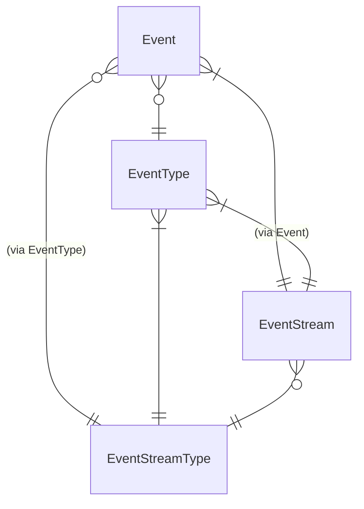

ABC270 に参加した。 1161 → 1181 (+20) 。 D も F もうまくやれば解けそうな気がした……。 E が解けたのは良かった。解けなかったらかなり落ちたはず。

<https://atcoder.jp/users/bouzuya/history/share/abc270>

---

[bouzuya/rust-sandbox] twiq 実装メモ (4)

作業のスタックの把握。

- `user` を解決するところまで動作させたい
- repository などの実装が提供されていない
- `EventStore` trait を実装したい
- `FirestoreEventStore` は一意性検査などで時間がかかってしまう
- `InMemoryEventStore` を使う `InMemoryUserRepository` をつくりたい
- `User::from_event_stream` をつくりたい
- `RawEvent` (`event_store_core::Event`) から `Event` を `type` が原因でうまくとりだせない

Event, EventType, EventStream, EventStreamType の ERD 。

- `impl TryFrom<RawEvent> for Event` をつくっていく
- 各 aggregate event に `type` を追加する
- `impl TryFrom<RawEvent> for domain::aggregate::x::Event` をつくる
- domain event と aggregate event の重複が多いので `RawEvent` への変換をひとまず domain event のみにして domain event と aggregate event 間の変換を設ける

---

今日のコミット。

- [rust-sandbox](https://github.com/bouzuya/rust-sandbox) 18 commits
  - [twiq: Add User::from_event_stream](https://github.com/bouzuya/rust-sandbox/commit/9462ebe8164ff26fdb4ab14b5fb2c23dab825888)
  - [twiq: Add conversion between DomainEvent and AggregateEvent](https://github.com/bouzuya/rust-sandbox/commit/6167c91abed675d5afcfdc2d21a6b32cdadb6118)
  - [twiq: Remove RawEvent conversion from aggregate event](https://github.com/bouzuya/rust-sandbox/commit/aea1ba9bac9695eb499ca5d0eb87a2dddd98324d)
  - [twiq: Fix firestore_event_store::event_to_fields](https://github.com/bouzuya/rust-sandbox/commit/b6348a8ac70bfe6caaffdc690380f5aae3c7ddef)
  - [twiq: Fix impl TryFrom&lt;RawEvent&gt; for Event](https://github.com/bouzuya/rust-sandbox/commit/d8d88b0a7fa0a45d3d99a70b5ba635fae5741fb0)
  - [twiq: Add impl TryFrom&lt;RawEvent&gt; for UserRequestStarted](https://github.com/bouzuya/rust-sandbox/commit/82c5f4477afbe91937630e8dd4b24c8a0e63fcc0)
  - [twiq: Add impl TryFrom&lt;RawEvent&gt; for UserRequestFinished](https://github.com/bouzuya/rust-sandbox/commit/6ed9ac68413e77da6bc113cc55ef8b2f24ccd9bf)
  - [twiq: Add impl TryFrom&lt;RawEvent&gt; for UserRequestCreated](https://github.com/bouzuya/rust-sandbox/commit/5686ee4f97b99443af96c15a53af5f822f7f27b3)
  - [twiq: Add impl TryFrom&lt;RawEvent&gt; for UserUpdated](https://github.com/bouzuya/rust-sandbox/commit/83ccbbfd61cd15811146f7fcb74828b2242aa21a)
  - [twiq: Add impl TryFrom&lt;RawEvent&gt; for UserRequested](https://github.com/bouzuya/rust-sandbox/commit/b0a6d73be9a6dac9ea97356dfa46418546038e01)
  - [twiq: Add impl TryFrom&lt;RawEvent&gt; for UserCreated](https://github.com/bouzuya/rust-sandbox/commit/ab273cc1984324f6aa12957f7371e6379034284c)
  - [twiq: Add UserRequestStarted::r#type](https://github.com/bouzuya/rust-sandbox/commit/d450780ef667a713c4701bb56eab6cf9d3dbdc0e)
  - [twiq: Add UserRequestFinished::r#type](https://github.com/bouzuya/rust-sandbox/commit/522eea5d1e5885e33b2deea00fa0f6329fb338d6)
  - [twiq: Add UserRequestCreated::r#type](https://github.com/bouzuya/rust-sandbox/commit/2c08409015e930d08678cc05624c7582ee09aa20)
  - [twiq: Add UserUpdated::r#type](https://github.com/bouzuya/rust-sandbox/commit/8981752c1d4de50bbec98ecdb8576a7cdc6bd4ff)
  - [twiq: Add UserRequested::r#type](https://github.com/bouzuya/rust-sandbox/commit/a57754cdb32952d656400081a46b4dd288515473)
  - [twiq: Add UserCreated::r#type](https://github.com/bouzuya/rust-sandbox/commit/f1b20a260448d4c4fd31e572dcf335edf1c102f4)
  - [twiq: Add event-erd to docs](https://github.com/bouzuya/rust-sandbox/commit/7db517a3baf7827d20e144ef83b62adf078a06c1)
- [rust-atcoder](https://github.com/bouzuya/rust-atcoder) 1 commit
  - [abc270 a, b, c, e](https://github.com/bouzuya/rust-atcoder/commit/46ba9d6542d44aabb4cc85a6c33fddeba297f4b2)

[bouzuya/rust-sandbox]: https://github.com/bouzuya/rust-sandbox
